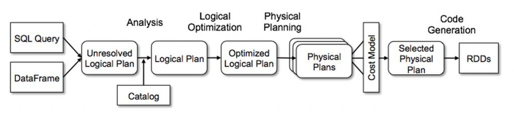

在大数据的一些具有SQL功能的框架中，比如Hive，Flink使用Apache Calcite 来做SQL的Query优化。
而Catalyst是Spark官方为Spark SQL设计的Query优化框架， 基于函数式编程语言Scala实现。
Catalyst有一个优化规则库，可以针对Spark SQL语句进行自动分析优化。而且Catalyst利用Scala的强大语言特性，
例如模式匹配和运行时元程序设计(基于Scala Quasiquotes)，使得开发者可以简单方便的定制优化规则。

一条SQL的处理过程如下：



* 首先会通过解析器，将其解析为一个抽象语法树(AST)，这叫做UnresolvedRelation LogicalPlan。

* 之后进入analysis阶段，可以将其分为几个子阶段
    * `Hints` 比如BroadcastJoinHints处理
    * `Simple Sanity Check` 简单check，比如检查SQL中的Function是否存在
    * `Substitution` 对SQL中的一些进行替换，比如如果union 只有一个child，则取消union
    * `Resolution` 对SQL中的一些信息进行绑定，这样就是Resolved LogicalPlan
    * `Post-Hoc Resolution resolution`之后的操作，默认是空，用户可以自己注入
    * 之后还有其他阶段，所以analysis阶段，不止resolution

* 接下来进行optimization阶段，使用Rule对LogicalPlan 进行优化，得到Optimized LogicalPlan

* 之后是通过使用`SparkStrategy`将`LogicalPlan`转换为可执行的物理计划`SparkPlan`。

* 之后进行codeGen

LogicalPlan是逻辑计划，SparkPlan是物理计划，两者都是QueryPlan的子类。

    abstract class SparkPlan extends QueryPlan[SparkPlan] with Logging with Serializable

    abstract class LogicalPlan
    extends QueryPlan[LogicalPlan]
    with LogicalPlanStats
    with QueryPlanConstraints
    with Logging

Rule不会发生质变，即logical plan=>logical plan，spark plan=>spark plan，Strategy会发生质变，即logical plan=>physical plans。

## 1、Parser
    class SparkSqlParser(conf: SQLConf) extends AbstractSqlParser

    abstract class AbstractSqlParser extends ParserInterface with Logging

    trait ParserInterface

例子：
1. PlanParserSuite中的test("simple select query")

## 2、Analyzer
    class Analyzer(
    catalog: SessionCatalog,
    conf: SQLConf,
    maxIterations: Int)
    extends RuleExecutor[LogicalPlan] with CheckAnalysis

分析阶段的规则基本都在Analyzer的batches里面列举，然后调用execute方法生效。

    object EliminateUnions extends Rule[LogicalPlan] {
    def apply(plan: LogicalPlan): LogicalPlan = plan transform {
    case Union(children) if children.size == 1 => children.head
    }
    }

例子
1. AnalysisSuite中的test("Eliminate the unnecessary union")

## 3、Optimizer
    abstract class Optimizer(sessionCatalog: SessionCatalog)
    extends RuleExecutor[LogicalPlan]

优化阶段的规则基本都在Optimizer的batches里面列举，然后调用execute方法生效。

例子
1. ConstantFoldingSuite

## 4、WSCG
WSCG是`WholeStageCodeGeneration`的英文简称，翻译过来就是：全周期代码生成。

[参考资料](https://github.com/yilab/spark-notes/blob/master/second_generation_tungsten_engine.md)

在Spark1.x时代，Spark SQL使用「火山迭代模型」。我们举个例子：

```sparksql
select count(*) from table where name='test';
```

要执行这个查询，Spark 1.x会使用一种最流行、最经典的查询求值策略，也就是：`Volcano Iterator Model`。如下图：


在这种模型中，一个查询会包含多个operator，每个operator都会实现一个接口，提供一个next()方法，该方法返回operator tree中的下一个operator。

举例来说，上面那个查询中的filter operator的代码大致如下所示：

```scala
class Filter(child:Operator, predicate:(Row => Boolean))extends Operator{
  def next():Row ={
    var current = child.next()
    while(current == null || predicate(current)) {
      current = child.next()
    }
    return current
  }
}
```

让每一个operator都实现一个iterator接口，可以让查询引擎优雅的组装任意operator在一起。而不需要查询引擎去考虑每个operator具体的一些处理逻辑，比如数据类型等。

Vocano Iterator Model也因此成为了数据库SQL执行引擎领域内过去30年中最流行的一种标准。而且Spark SQL最初的SQL执行引擎也是基于这个思想来实现的。

对于上面的那个查询，如果我们通过代码来手工编写一段代码实现那个功能，代码大致如下所示：

```scala
def function() {
  var count = 0
  for(ss_item_sk in store_sales) {
    if(ss_item_sk == 1000) {
      count += 1
    }
  }
}
```

手写代码的性能比Volcano Iterator Model高了一整个数量级，而这其中的原因包含以下几点:

* 避免了virtual function dispatch：在Volcano Iterator Model中，至少需要调用一次next()函数来获取下一个operator。这些函数调用在操作系统层面，会被编译为virtual function dispatch。而手写代码中，没有任何的函数调用逻辑。虽然说，现代的编译器已经对虚函数调用进行了大量的优化，但是该操作还是会执行多个CPU指令，并且执行速度较慢，尤其是当需要成百上千次地执行虚函数调用时。
* 通过CPU Register存取中间数据，而不是内存缓冲：在Volcano Iterator Model中，每次一个operator将数据交给下一个operator，都需要将数据写入内存缓冲中。然而在手写代码中，JVM JIT编译器会将这些数据写入CPU Register。CPU从内存缓冲种读写数据的性能比直接从CPU Register中读写数据，要低了一个数量级。
* Loop Unrolling和SIMD：现代的编译器和CPU在编译和执行简单的for循环时，性能非常地高。编译器通常可以自动对for循环进行unrolling，并且还会生成SIMD指令以在每次CPU指令执行时处理多条数据。CPU也包含一些特性，比如pipelining，prefetching，指令reordering，可以让for循环的执行性能更高。然而这些优化特性都无法在复杂的函数调用场景中施展，比如Volcano Iterator Model。

如果要对Spark进行性能优化，一个思路就是在运行时动态生成代码，以避免使用Volcano模型，转而使用性能更高的代码方式。要实现上述目的，就引出了Spark第二代Tungsten引擎的新技术:WholeStageCodeGeneration(WSCG)。

通过该技术，SQL语句编译后的operator-treee中，每个operator执行时就不是自己来执行逻辑了，而是通过whole-stage code generation技术，动态生成代码，生成的代码中会尽量将所有的操作打包到一个函数中，然后再执行动态生成的代码。

WSCG生成的手写代码解决了操作符之间频繁的虚函数调用，以及操作符之间数据交换引入的内存随机访问。手写代码中的每一条指令都是明确的，可以顺序加载到 CPU 寄存器，源数据也可以顺序地加载到 CPU 的各级缓存中，因此，CPU 的缓存命中率和工作效率都会得到大幅提升。

在生成了RDD后，RDD算子中执行的代码会通过Code Generate自动生成代码来执行。

CodeGenerator类

    def generate(expressions: InType, inputSchema: Seq[Attribute]): OutType =
    generate(bind(expressions, inputSchema))

    def generate(expressions: InType): OutType = create(canonicalize(expressions))

    org.apache.spark.sql.catalyst.expressions.codegen.GenerateUnsafeProjection.create

使用Janino来将source code编译成class

## 实践
借助SparkSessionExtensions进行扩展解析器和优化器，借助SparkSession的experimental.extraStrategies扩展策略。

1. 扩展解析器，禁止泛查询，遇到select *提示必须指定列

```scala
class MyParser(parser: ParserInterface) extends ParserInterface {

  /**
   * Parse a string to a [[LogicalPlan]].
   */
  override def parsePlan(sqlText: String): LogicalPlan = {
    val logicalPlan = parser.parsePlan(sqlText)
    logicalPlan transform {
      case project@Project(projectList, _) =>
        projectList.foreach {
          name =>
            if (name.isInstanceOf[UnresolvedStar]) {
              throw new RuntimeException("You must specify your project column set," +
                " * is not allowed.")
            }
        }
        project
    }
    logicalPlan
  }

  /**
   * Parse a string to an [[Expression]].
   */
  override def parseExpression(sqlText: String): Expression = {
    parser.parseExpression(sqlText)
  }

  /**
   * Parse a string to a [[TableIdentifier]].
   */
  override def parseTableIdentifier(sqlText: String): TableIdentifier = {
    parser.parseTableIdentifier(sqlText)
  }

  /**
   * Parse a string to a [[FunctionIdentifier]].
   */
  override def parseFunctionIdentifier(sqlText: String): FunctionIdentifier = {
    parser.parseFunctionIdentifier(sqlText)
  }

  /**
   * Parse a string to a [[StructType]]. The passed SQL string should be a comma separated list
   * of field definitions which will preserve the correct Hive metadata.
   */
  override def parseTableSchema(sqlText: String): StructType = {
    parser.parseTableSchema(sqlText)
  }

  /**
   * Parse a string to a [[DataType]].
   */
  override def parseDataType(sqlText: String): DataType = {
    parser.parseDataType(sqlText)
  }
}
```

```scala
object MyParserApp {
  def main(args: Array[String]): Unit = {
    type ParserBuilder = (SparkSession, ParserInterface) => ParserInterface
    type ExtensionsBuilder = SparkSessionExtensions => Unit
    val parserBuilder: ParserBuilder = (_, parser) => new MyParser(parser)
    val extBuilder: ExtensionsBuilder = { e => e.injectParser(parserBuilder) }

    val spark = SparkSession
      .builder()
      .master("local")
      .withExtensions(extBuilder)
      .getOrCreate()

    spark.sql("select * from values(1,'1')").show()
  }
}
```

2. 扩展优化器


3. 扩展策略

SparkStrategies包含了一系列特定的Strategies，这些Strategies是继承自QueryPlanner中定义的Strategy，
它定义接受一个Logical Plan，生成一系列的Physical Plan。

通过Strategies把逻辑计划转换成可以具体执行的物理计划，代码如下：

```scala

```

后续：
1. sql parser、ast以及anltr
